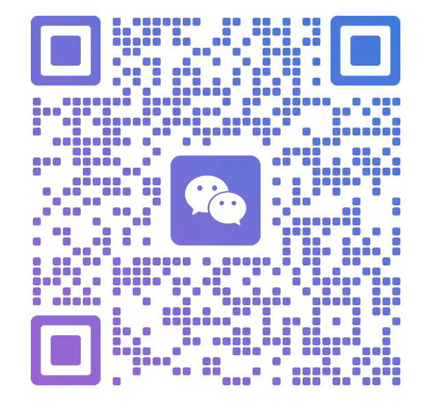

# 求职助手使用手册

# 1 简介

这是一个辅助求职面试各个环节的AI助手。覆盖简历维护/优化/导出，职位搜索，职位匹配，知识要点复习，面试各个环节。

### 软件适用场景

- 平时简历维护，支持中英文简历的优化和导出
- 职位搜索，支持根据多个关键字聚合搜索，智联，BOSS，（智联，力扣开发中）等平台的职位。部分平台的职位还可以直接投递和沟通。
- 职位匹配，使用AI分析个人和职位的匹配程度，给出综合建议。特色：会根据职位信息，搜索公司在职友集，天眼查等的信息，评估潜在风险。
- 编程面试，分析屏幕上的题目，实时给出解题思路和代码，即便面试官要求分享屏幕，也不会被发现
- 笔试题目，不会导致笔试网页失焦，可规避“跳出网页”检测
- 其他场景（如：英语机试 等）可以通过在设置界面中配置“自定义提示词”来自行扩展

### 核心能力

- 简历维护，平时需要维护中英文简历，AI辅助优化简历内容，语言。支持导出成pdf,docx, html, markdown
- 职位搜索，支持根据多个关键字聚合搜索，智联，BOSS，（智联，力扣开发中）等平台的职位。
- 职位匹配，使用AI分析个人和职位的匹配程度，给出综合建议。特色：会根据职位信息，搜索公司在职友集，天眼查等的信息，评估潜在风险。
- 通过快捷键抓取屏幕内容、电脑声音等信息，发送给大模型进行分析
- 窗口在屏幕分享时，不会被发现
- 窗口置顶半透明展示，不会导致原页面失焦，从而规避“跳出网页”检测

### 项目特点

- AI辅助求职面试各个环节。
- 简单易用，只需要配置 API_BASE_URL 和 API_KEY 即可开始使用。
- 重点支持编程相关算法题目，同时也支持其他题型（单选、多选，解答等题型）。
- 支持多种编程语言，包括 Python、JavaScript、Java、C++ 等。
- 本应用具有隐身能力，即使被要求分享屏幕，面试官也看不到助手的界面。

# 2 快速开始

1. 求职的第一步是维护您最新的简历，借助本软件对 您的简历进行优化。
2. 简历准备好后，就可以开始搜索职位，根据关键词和搜索条件聚合搜索相关职位。本软件还可以根据您的简历自动提取关键词，推荐合适的职位，直接投递。
3. 和HR联系上，后边就是面试环节。本软件可以辅助在线面试，AI辅助解答机试题目，面试官问题语音转成文本发给AI解答，实时辅助应聘人解答。整个面试结束，还会发所有面试信息给AI，做复盘和总结。

# 3 功能介绍

## 3.1 简历

#### 3.1.1 简历维护

支持输入和编辑中文和英文两个版本的简历，简历都是存储在本地，随时可以访问，修改和维护。BOSS直聘流行的简历格式，按块输入和编辑。

#### 3.1.2 简历优化

AI 辅助简历优化：从内容完整度、成就量化、ATS 可读性、关键词覆盖等维度给出优化建议。避免您的简历还没有到HR手里，先被ATS系统给毙了。针对英文简历，还可以优化您的英文语法和用词等问题。

#### 3.1.3 匹配职位

输入职位描述 ，或者截图职位描述 （AI抓取图片分析职位描述），或者给出职位链接（AI到链接爬取职位描述），AI 分析匹配度并给出是否适合投递的建议。

匹配会从**简历和职位**匹配度，**公司评估**两个大的方面评估：

- 简历和职位的匹配度：会给出**核心优势**，**主要差距**和**改进建议**。
- 公司评估：
  - 职友集评价：AI会去职友集搜索公司相关信息，给出职友集的综合评价。
  - 天眼查评价：AI会去天眼查，查看公司相关信息，确保公司真实可靠，经营没有异常和风险。
  - 脉脉评价：AI会去脉脉爬取公司的信息，评估公司的工作氛围信息。

#### 3.1.4 职业规划

AI结合您的简历信息，给出清晰可以执行的职业规划建议。

#### 3.1.5 简历导出

为了方便发给招聘者或者上传招聘网站，还可以把简历导出成pdf/docx/html/markdown，发给招聘方/上传招聘网站。当前简历语言是中文就会导出中文简历，是英文就会导出英文简历。
导出时，期望职位，自我介绍等不会导出。导出pdf时还可以通过设置，选择是否需要加水印。

## 3.2 职位搜索

#### 3.2.1 职位搜索

职位搜索支持搜索猎聘和BOSS直聘两个平台的职位信息，更多平台的支持还在开发中。 可以根据职位关键字，工作地点，学历要求，薪资上下限，工作经验，公司等信息过滤搜索。搜索结果是两个平台结果的聚合。

点击具体的职位会显示职位的详细信息。同时会去获取详细的职位描述，同时会针对职位的新鲜度（发布时间），职位描述的清晰度和hr的活跃度给出评分。

> [!CAUTION]
>
> ***第一次搜索职位时，BOSS，智联之的平台会弹出浏览器，需要扫码或者手机号登录。登录过程不用&不要手动关闭浏览器。软件会去获取登录信息，获取成功后自动关闭弹出的浏览器。***

> [!CAUTION]
>
> ***搜索职位时，最多输入3个关键字。并且不要频繁搜索。这样会触发招聘网站的风控动作，有可能会封您的招聘平台账号。***

也可以直接点击后边的申请，给招聘方发送消息，智联和BOSS都是先发消息，沟通中给简历和联系。具体联系沟通，发送简历还需要到招聘平台，这部分是招聘平台的核心，本软件不能做（容易被封号），只能辅助您，使您找工作过程更方便快捷。发送沟通消息后，你可以在手机app上和招聘方进一步沟通联系。

#### 3.2.2 职位推荐

AI会从您的简历和过往申请历史，提取3个关键词，然后结合您搜索时设置的过滤条件，去到智联和BOSS两个平台搜索相关职位，然后从职位匹配度，技能匹配度，经验相关性，学历，工作年限和期望工作地点等方面评估打分，最终的按照得分最高的20个职位推荐返回。

## 3.3 面试

本软件还可以实时辅助您在线面试过程。打开本软件，让后进入面试的视频会议。您可以通过按快捷键录取屏幕，截屏会发给AI，AI会给出问题的解答，显示在您的屏幕上（对于视频会议中其他人是看不到的，录屏也看不到）。同时还可以实时录取视频会议声音，比如面试官问您的问题，会转录成文字，发送给AI，AI会给出解答，显示到您的屏幕。

#### 3.3.1 截屏和语音转录答题

面试开始后，进入视频会议。打开本软件，按ctrl+T,就会开始录音，

> [!CAUTION]
>
> ***需要网页进入面试的视频会议，语音转录才能使用。所以建议使用飞书，zoom等可以浏览器入会的视频会议系统，腾讯会议要避开，不能语音转录。如果你不需要实时截取视频会议里面试官的语音问题，也可以不用语音转录，只用截屏答题功能。***

#### 3.3.2 面试复盘

面试结束后，软件会把面试的所有内容：问题截屏，AI回答，语音转录的文本，AI解答全部打包发送给AI，AI会针对您的本次面试，给出一个复盘，哪些地方做的好，哪些地方做的不够好，并给出改进建议。

# 4 FAQ

### BOSS被风控如何处置？

通常初次被风控，重新登录，拖动验证码可以恢复正常。如果频繁触发风控，BOSS会触发一段时间的封号。封号时长会随着触发次数增加。

### 如何屏幕截图？

按下Ctrl↵快捷键即可截取当前屏幕的截图。截图会自动显示在应用中。

### **如何处理题目超过一屏的情况？**

按下CtrlShift↵快捷键即可在当前对话中追加截图并生成解题建议。

### 分享屏幕时，对方能看到应用吗？

工具窗口在共享屏幕时自动隐藏(对方不可见)，但小部分会议软件可能需要配置才能隐藏。所以如果你对隐身功能有需求，务必在正式使用前用「当前电脑」+「当前会议软件」测试一下。更多细节请参考 [GitHub Wiki](https://github.com/shunliz/career-assistant/wiki/隐身配置)。

### 鼠标移过窗口时，光标会不会变？

本工具提供了开关，可以开启或关闭鼠标穿透。开启鼠标穿透时，窗口对鼠标隐身，你需要通过快捷键来操作窗口。切换「鼠标穿透」开关的快捷键是 CtrlM 。窗口右下角会显示当前状态。

### 语音转录功能是什么？如何使用？

语音转录功能可以实时将面试官的语音或题目朗读转为文字，辅助 AI 更好地理解题意。使用前需在「设置」中配置百炼平台 API Key，然后按下CtrlT开始/暂停转录。转录文本会在截图时自动附带提交给 AI。

### 转录的文本可以单独清除吗？

可以。按下CtrlShiftT即可清除当前转录文本，清除后的文本不会提交给 AI。截图时也会自动清除已有转录文本。

# 5 联系支持

遇到问题可以到https://github.com/shunliz/career-assistant-ops/issues提交问题。

需要支持可以扫码加开发者微信联系开发者。

